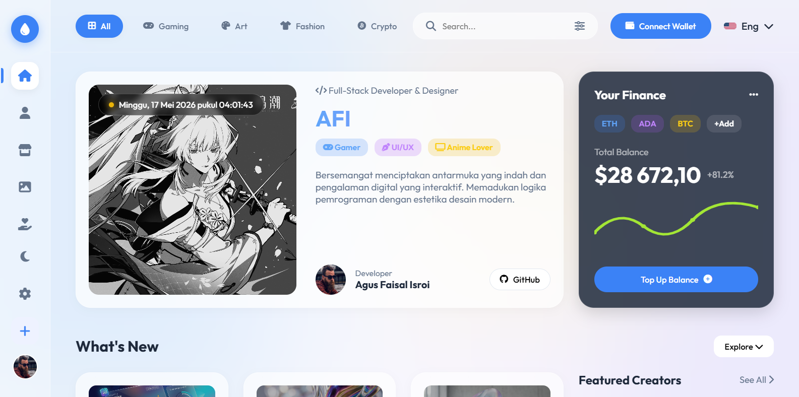

# AFI - Liquid Glass Portfolio

A stunning, high-performance personal portfolio and dashboard built with a modern **Liquid Glass** (glassmorphism) aesthetic. This project showcases a blend of beautiful UI design and interactive web components.



## ✨ Key Features

- **Liquid Glass Design**: A premium glassmorphism aesthetic with vibrant mesh background blobs and frosted glass panels.
- **Dynamic Dashboard**: A central hub featuring a featured banner, finance widgets, and interactive category cards.
- **Market & Assets Dashboard**: Real-time asset tracking with live pulse animations and sparkline charts for Crypto, Gold, and Stocks.
- **Interactive Sidebar**: Smooth navigation between Home, About, Market, Gallery, and Donation sections.
- **World Weather Widget**: Integrated Windy.com map for global weather insights and city-specific conditions.
- **Fully Responsive**: Optimized for all devices, from large desktops to mobile screens.
- **Modern Tech Stack**: Built with pure HTML, Vanilla CSS, and JavaScript for maximum performance and compatibility.

## 🛠️ Technology Stack

- **Core**: HTML5, Vanilla JavaScript
- **Styling**: CSS3 (Modern features like backdrop-filter, variables, and grid/flexbox)
- **Icons**: [Font Awesome 6](https://fontawesome.com/)
- **Typography**: [Google Fonts (Outfit)](https://fonts.google.com/)
- **Widgets**: Windy.com (Weather Embed)

## 🚀 How to Run

1. **Clone the repository**:
   ```bash
   git clone https://github.com/AGUSFAISALISROI/AFI.git
   ```
2. **Open the project**:
   Simply open `index.html` in any modern web browser.

No build tools or servers are required for the basic preview, though using a local server (like Live Server or http-server) is recommended for the best experience.

## 📁 Project Structure

```text
├── assets/             # Project images and assets
│   ├── img/            # UI images and icons
│   └── preview.png     # README preview image
├── index.html          # Main entry point
├── style.css           # Core design system and layout
└── script.js           # Dynamic interactions and logic
```

## 👤 Author

**Agus Faisal Isroi (AFI)**
- Full-Stack Developer & UI/UX Designer
- GitHub: [@AGUSFAISALISROI](https://github.com/AGUSFAISALISROI)

---
*Created with passion for beautiful web design.*
